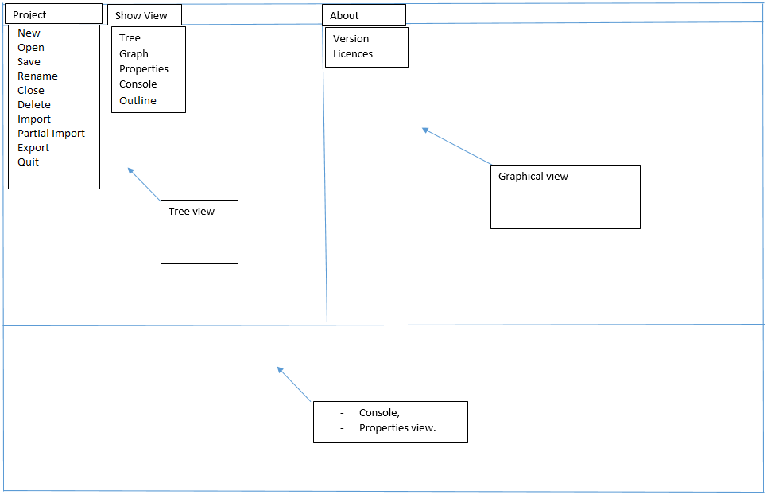
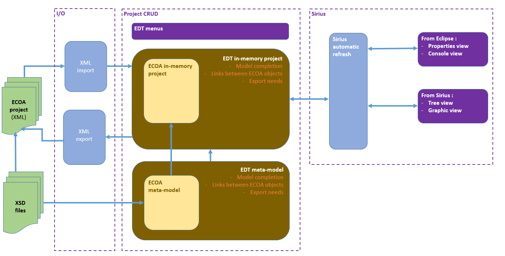
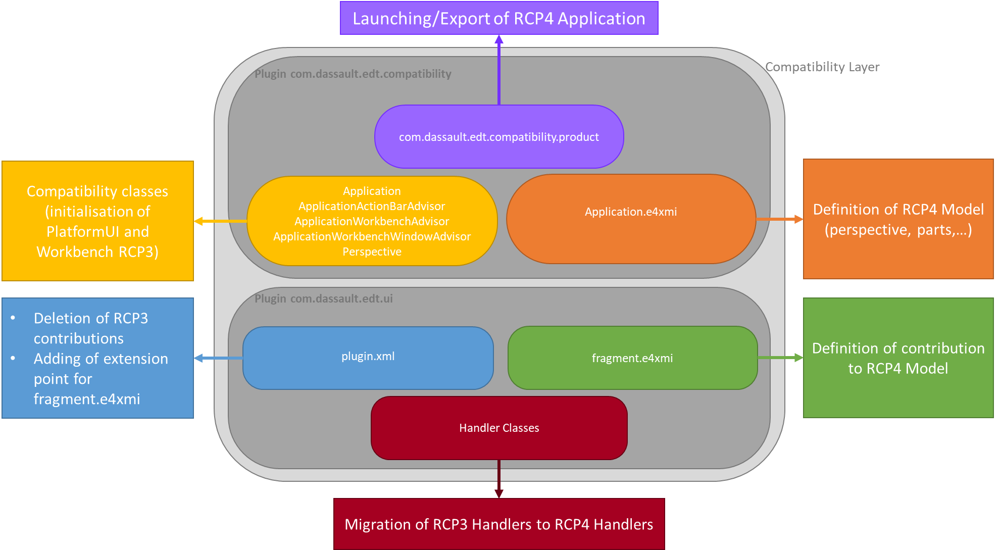
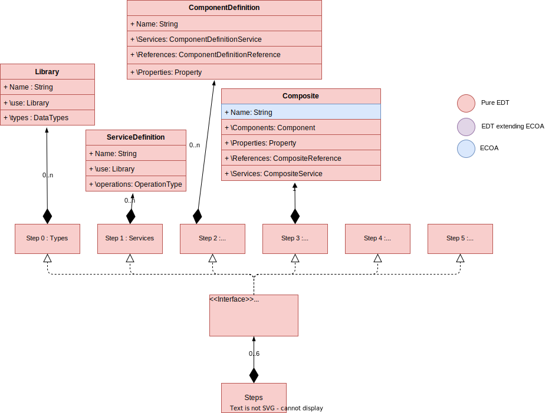
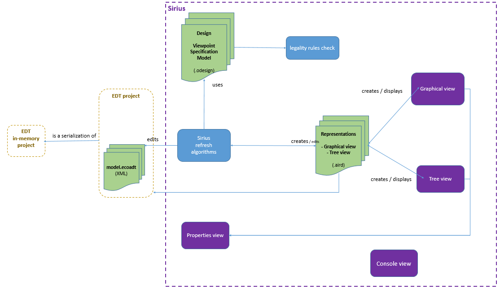

# ECOA Design Tool Design Guide

Copyright 2023 Dassault Aviation

MIT License (see LICENSE.txt)


## 1. Introduction
### 1.1. What is EDT
EDT stands for ECOA Design Tool. It's a tool aimed at facilitating the design of ECOA projects, especially graphically.<br>
For more information about ECOA you can visit http://www.ecoa.technology/. 
### 1.2. Features
The format of ECOA projects files is XML. So EDT has to be able to :
- deal with ECOA concepts in its own internal way, a way that suits EDT users needs. EDT deals internally with EDT projects, not ECOA projects.
- create / read / update / delete EDT projects,
- import existing ECOA projects in a XML format, and transform them into EDT projects. The projects become separate from the original XML files. Note : it is only possible to import an ECOA XML project (full or not), not to import single XML files into an existing EDT project (e.g. a deployment file).
- export EDT projects into ECOA XML files, so that users can use them in an ECOA standardized way.
### 1.3. GUI outline
The Graphical User Interface should contain :
- ways to handle available actions (menus),
- areas for a tree view, a graphical view and a properties view,
- a console for messages.

Here is how it can look like :

  
*GUI outline*
### 1.4. Technical choices
The Eclipse (for Java) ecosystem meets all of EDT's needs :
- Eclipse RCP : the Eclipse platform is used to create EDT.
- Eclipse EMF :<br>
The structure of ECOA XML files is defined in a set of XSD files.<br>
The XSD files define the meta-model, i.e. the objects that can be created to create an ECOA model.<br>
Eclipse EMF generates Java objects from XSD files. This is how we generated an ECOA meta-model (see below for details).
- Eclipse Sirius : Sirius is a software that allows a user to graphically create EMF models.
- RCP3 & RCP4 compatibility :<br>
EDT has to be compatible with RCP3 because Sirius is based on RCP3.<br>
EDT has to be compliant with RCP4 as a provision for possible future external plugins.<br>
As a result, EDT is a RCP4 application with a RCP3 compatibility layer.

## 2. Architecture
### 2.1. Functional
The following diagram shows EDT's architecture from a functional point of view :
  
*EDT architecture*


### 2.2. Technical
The following Eclipse projects / plugins / packages form the EDT software :
- com.dassault.ecoa.model, com.dassault.ecoa.model.edit, com.dassault.ecoa.model.editor : this is the generated ECOA meta model.
- com.dassault.edt.compatibility : the Eclipse product.
- com.dassault.edt.design : the Sirius files and classes.
- com.dassault.edt.export : export to XML files.
- com.dassault.edt.import : import from XML files.
- com.dassault.edt.log : log (to the console, to a pop up, to a file).
- com.dassault.edt.model, com.dassault.edt.model.edit, com.dassault.edt.model.editor : the EDT model.
- com.dassault.edt.runtime.feature : some projects are grouped into a feature.
- com.dassault.edt.ui : the graphical user interface.

## 3. Design
### 3.1. Eclipse RCP
ECOA Design Tool is a RCP4 Application with a Compatibility Layer. The Compatibility Layer makes Eclipse 3.X plugins and application available, by defining a RCP3 Workbench.

 
*ECOA Design Tool RCP3/4 Compatibility Layer*

The RCP3 Workbench is defined in the Compatibility Classes (in yellow) and is necessary for the Sirius plugins to work.

### 3.2. Eclipse EMF
This paragraph describes the construction of the ECOA model and the EDT model with EMF.
#### 3.2.1. ECOA model
This model is obtained from the ECOA meta-model XML schema (.xsd), with all ecore generated from XSD contained in one genmodel (ECOADT.genmodel).  
It was done with the help of this tutorial https://www.eclipse.org/modeling/emf/docs/1.x/tutorials/xlibmod/xlibmod_emf1.1.html.  
For each XML, the main EMF Object is DocumentRoot and the DocumentRoot contains the main XML object (e.g. Composite, Library, ComponentType...).
The association between XSD and ECOA XML files is described in [ECOA_XML_Implementation](../ECOA_Implementation/ECOA_XML_Implementation.md)

##### 3.2.1.1. Specificities
###### Modification of ecore name and prefixes
- When generating the ecore, the name and prefix correspond to the last segment of the java package and the package name is obtained from the namespace. In our case, the xsd namespace generally ends with "-2.0" or "200912", making the ecore hard to use.
Thus the name and prefix were modified for each ecore:
<details><summary>Click to see the modification table</summary>

| NameSpace | Ecore filename | Ecore prefix|Ecore NsPrefix|Ecore package name| XML files |
| ------ | ------ |------|------|------|------|
| http://docs.oasis-open.org/ns/opencsa/sca/200912 | sca.ecore |sca|sca|sca| \*.componentType <br>\*.composite <br>*.impl.composite
| http://www.w3.org/2001/XMLSchema | schema.ecore |xsd|xsd|xsd|Used for xsd:string type of SCA-Properties
|http://www.ecoa.technology/bin-desc-2.0|BinDesc.ecore|bin|""|_2|bin-desc.xml
|http://www.ecoa.technology/cross-platforms-view-2.0|view.ecore|view|""|_2|cross_platform_view.xml
|http://www.ecoa.technology/deployment-2.0|deployment.ecore|dep|""|_2|*.deployment.xml
|http://www.ecoa.technology/implementation-2.0|implementation.ecore|imp|""|_2|*.impl.xml
|http://www.ecoa.technology/insertion-policy-2.0|insertionPolicy.ecore|pol|""|_2|*_insertions_policies.xml
|http://www.ecoa.technology/interface-2.0|interface.ecore|inter|""|_2|*.interface.xml
|http://www.ecoa.technology/interface-qos-2.0|qos.ecore|qos|""|_2|*.interface.qos.xml
|http://www.ecoa.technology/logicalsystem-2.0|logicalSystem.ecore|log|ecoa|_2|\*.logical-system.xml
|http://www.ecoa.technology/module-behaviour-2.0|moduleBehaviour.ecore|mod|""|_2|*.behaviour.xml
|http://www.ecoa.technology/project-2.0|project.ecore|proj|""|_2|*.project.xml
|http://www.ecoa.technology/sca-extension-2.0|scaExt.ecore|scaext|ecoa-sca|scaExt| Used for SCA-Properties
|http://www.ecoa.technology/types-2.0|types.ecore|typ|""|_2|*.types.xml
|http://www.ecoa.technology/udpbinding-2.0|UDPbinding.ecore|udp|""|_2|udp-binding.xml
|http://www.ecoa.technology/uid-2.0|uid.ecore|uid|""|_2|*.ids.xml
</details>

- The Ecore prefix is used when generating the java, e.g. the factory class of BinDesc.ecore is binFactory.
- The ecore NsPrefix is used when exporting the XML to declare the namespace prefix, e.g. when scaExt.ecore namespace is used in a xml it will be written  xmlns:ecoa-sca="http://www.ecoa.technology/sca-extension-2.0".
- The ecore package name is notably used in Sirius to create the .odesign.

##### 3.2.1.2. Problems encountered
###### xml.xsd
**1) xml:lang**
- For the attribute lang of the "Documentation" attribute, a restriction is implemented in the xsd to allow "un-declaration" of xml:lang with an empty string.

```xml
<xs:simpleType>  
    <xs:union memberTypes="xs:language">  
        <xs:simpleType>  
            <xs:restriction base="xs:string">  
                <xs:enumeration value=""/>  
            </xs:restriction>  
        </xs:simpleType>  
    </xs:union>  
</xs:simpleType>  
```
- The empty string causes a problem with EMF that tries to create a variable with the enumeration value (i.e. an empty string), thus it needs to be removed from the ecore.
- If we want to use the xml:lang attribute, one solution is to remove the restriction in the xsd or generated ecore.

**2) Namespace**
- xml.xsd has the namespace "http://www.w3.org/XML/1998/namespace". This namespace already exists in EMF in the XMLNamespacePackage.<br>
--> This allows to reference the EMF package instead of generating the xml.xsd ecore, but Sirius needs an ecore and can not use java packages. So the problem of the xml:lang can not be resolved this way.<br>
--> If the xml.xsd is used, there will be ClassCastExceptions thrown, because EMF sees that the namespace URI is used, and assume it is XMLNamespacePackage that needs to be used. It is a not blocking exception, but not nice to have.

**SOLUTION FOUND**<br>
No solutions were found to have Sirius be able to use the EMF own namespace model or not have the ClassCastExceptions error.
Thus xml.xsd is not used and its reference in XMLSchema.xsd and sca-core-1.1-cd06-subset-2.0.xsd were removed.

**Resulting limitation**<br>
The attribute lang of documentation will never be imported from an xml or be exported. This can cause difference between the imported and exported xml.
###### The Any and AnyAttribute problem
- Some attributes like "value" in the element Property of the ComponentType are in the xsd defined with the attribute "any".
    - EMF creates in consequence an object that can contain any type of element, that is in EMF a FeatureMap object.
    - FeatureMaps can, to be more easy to understand, seen as a Map<EStructuralFeature,Object>. EStructuralFeature (ESF) corresponds to a feature of an EClass representing a structural property of the class, such as an attribute or a reference. The ESF can be obtained from the package.Literals. 
        -  Complex objects are represented by FeatureMaps, but generally getters exist natively in the class to easily retrieve the wanted elements. However, for Any attribute, no getters exist to extract precisely the element. To get the element, there is a need to know the type of object and instanciate it. To set the element, there is a need to know the package.Literals to use to have the good ESF.
    - Another problem with these attributes, is that to read them, there is a need to set the loading options "XMLResource.OPTION_EXTENDED_META_DATA" to "true". We do not have access to Sirius loading options, so there was a need to manage these attributes in the EDT model and not ECOA model.

#### 3.2.2. EDT model
The EDT model was generated by hand, there is no corresponding xsd. It represents mainly an extension of the ECOA model with a majority of classes inheriting from ECOA model classes.
The inheritance was created using https://www.vogella.com/tutorials/EclipseEMF/article.html#extending-an-emf-ecore-model-inheritance.

The EDT model is represented by EDT.genmodel that contains 
- EDTProject2.ecore :  Steps + overloading of sca.core (ComponentDefinition + Composite mainly)
- EDTQos.ecore : overloading of qos.ecore (Service QoS)
- EDTServices.ecore : overloading of interface.ecore (ServiceDefinition)
- EDTTypes.ecore : overloading of types.ecore (Library)  
- EDTDeployment.ecore : overloading of deployment.ecore (Deployment)
- EDTImplementation.ecore : overloading of implementation.ecore(ComponentImplementation)
- EDTLogicalSystem.ecore : overloading of logicalSystem.ecore (LogicalSystem)
- EDTBinDesc.ecore : overloading of BinDesc.ecore
- UDPBinding.ecore : overloading of UDPBinding.ecore (UDPBinding)
- EDTUID.ecore : overloading of uid.ecore

##### 3.2.2.1. Reasons of creation
1) Problems with Any and AnyAttribute elements,
2) Most objects of the ECOA architecture do not contain their name in the XML, their name corresponds to the filename. The name being essential to do the links between the different elements, and to export the projet in a ECOA XML format, there was a need to extend most original objects to add the name attribute.
3) Links between objects are not done directly in the XML, only the names of the linked objects are given. Example : when an object A references an object B, the XML only gives the name "B" as the value of the "A" attribute. The fact that the corresponding object A references the corresponding object B cannot be part of the generated ECOA model, so it has to be done in the EDT model.

###### How it was created
The majority of the EDT model classes inherit from ECOA model classes. When possible and simple to do, no inheritance is done (the EAttributes/EReferences are rewritten in a new Class). To do that we used mainly this tutorial https://www.vogella.com/tutorials/EclipseEMF/article.html#extending-an-emf-ecore-model-inheritance.  

There are two types of EReferences : the contained and the not contained. 
- The contained EReferences will be **contained** in the instance and correspond to complex attributes, for example the Services of the Component are contained EReferences, thus all their attributes are directly accessible in Component.  
- The not contained are references to elements in another class and are more similar to links, for example the ComponentImplementation attribute of a Component correspond to the Object ID of the ComponentImplementation.

Below you can see a general schema of the EDT model. The EDT model main object is "Steps" and it contains all the Steps folder. There are 6 Steps (Step0 --> Step5) that implement the "Step" interface. The "Step" interface is used to have a common "FolderName" attribute and allows the differents Steps to contain differents types of classes (Step0 contains only Types (=Library), Step1 only ServiceDefinitions (=ServiceDefinition) and so on).

  
*Major classes of the EDTModel*  


Below you can see a more detailed description of the InitialAssembly Classes. The Initial Assembly corresponds to a Composite that contains at least Components. The Components are closely linked to a ComponentDefinition, thus the ComponentReference links the ComponentDefinitionReference, the PropertyValue links the Property of ComponentDefinition and so on.  
  
*Initial Assembly and links with ComponentDefinition in EDTModel*  
##### 3.2.2.2. Constraints implemented and how
###### Unicity of names
- Uniqueness of name were done in the setPropertyValue function of the namespace edt.model.editor class, for example for the DataTypes :
    - The container (i.e the Library for DataType, Enum for EnumValue, Record and VariantRecord for Field) is obtained through eContainer() and then all the DataTypes are parsed to compare the names.  
    - For the DataTypes, the name can be a BasicType name (that consists in a overload of the BasicType), there will only be a warning. For the Field, EnumValue and Union, it is not authorized.

###### Inheritance of Definition for an instance
- The components of the Composite and the Service Instance QOS derive from their Definition counterpart (i.e. ComponentDefinition and ServiceDefinition), thus the instance contain links to their Definition (mainly the name is inherited this way for the export). The links and the derived links of the instance have to be synchronized with the Definition. The mechanisms for the Component are :
    - First then the link is modified, the sublinks (ComponentReferences, ComponentServices and Properties) are also updated, by clearing the three EList and adding the new sublinks. One problem was at the import and the reading of the model file by Sirius, the update is done in the setComponentDefinitionLink(), thus when a file is read, the sublinks are added before being read. To resolve the problem, the AddUnique() function of the sublinks EList are overriden to contain a verification if an object with the same name exists already. If it is the case, the ancient element is removed to be replaced.
    - Secondly there is a need to manage the modification in the Definition so that they are transmitted to the instance. This is done in the addUnique function of the Definition class : e.g. the adding of a ComponentDefinitionReference to a ComponentDefinition adds automatically a ComponentReference to the Component linked to the ComponentDefinition modified.

A similar processus is done for the display of ServiceOperation and ModuleOperations in the Implementation Graphical View.
   

##### 3.2.2.3. Main XML Limitations
The limitations can be found the section 'Limitations' of the file [ECOA-standard-implementation.md](../ECOA%20Standard%20Implementation/ECOA-standard-implementation.md).


### 3.3. Sirius
The following diagram summarizes EDT's use of Sirius :
  
*EDT's use of Sirius*

### 3.4. External plugins
#### 3.4.1. Loading external plugins
EDT provides the ability to load external plugins on startup.
If a user wants external plugins to be loaded in EDT, he has to :
- Create a folder "Ecoa" in the user home.
- Create a folder "EDTPlugins" and a file "plugins.ini" within "Ecoa".
- Put the Eclipse plugins (jar files) into "EDTPlugins".
- Put the list of plugins into "plugins.ini" : one in each line, sorted in loading order (the first one has to be loaded first, etc.). 
- Create a file "pluginsBind.ini" within "Ecoa". This file contains information on the plugins that actually appear on the GUI (menu item name, bundle, class to call, method to call, parameters if any).<br>

Finally, one of the plugins has to create the menu containing the menu items to display.