# ECOA Design Tool Developer Guide

Copyright 2023 Dassault Aviation

MIT License (see LICENSE.txt)


## 1. Installation
This paragraph describes the installation of the development environment for Windows.
### 1.1. JDK17
To install the Java Development Kit :
https://www.oracle.com/java/technologies/javase/jdk17-archive-downloads.html

### 1.2. Eclipse
To install Eclipse for Java : select and install version 4.24.
https://download.eclipse.org/eclipse/downloads/

### 1.3. <a id="eclext"></a>Eclipse extensions
Some Eclipse plugins are needed. Go to :
- -> Help
- -> Install New Software...
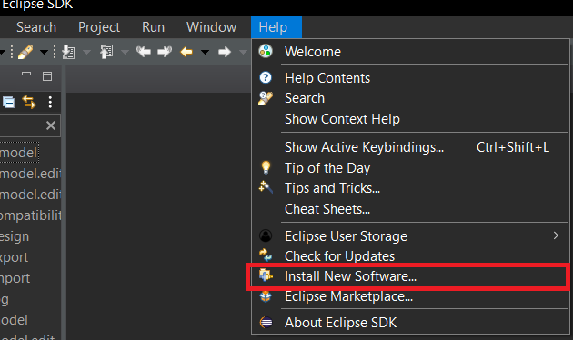


Then install :
- "Eclipse e4 Tools Developer Resources 4.24" (select the version corresponding to your Eclipse version).
- All "Windows Builder" software.
- "EMF – Eclipse Modeling Framework SDK"
- "Ecore Diagram Editor (SDK)"
- "XSD – XML Schema Definition SDK"
- "marketplace client"

Add Sirius update site :
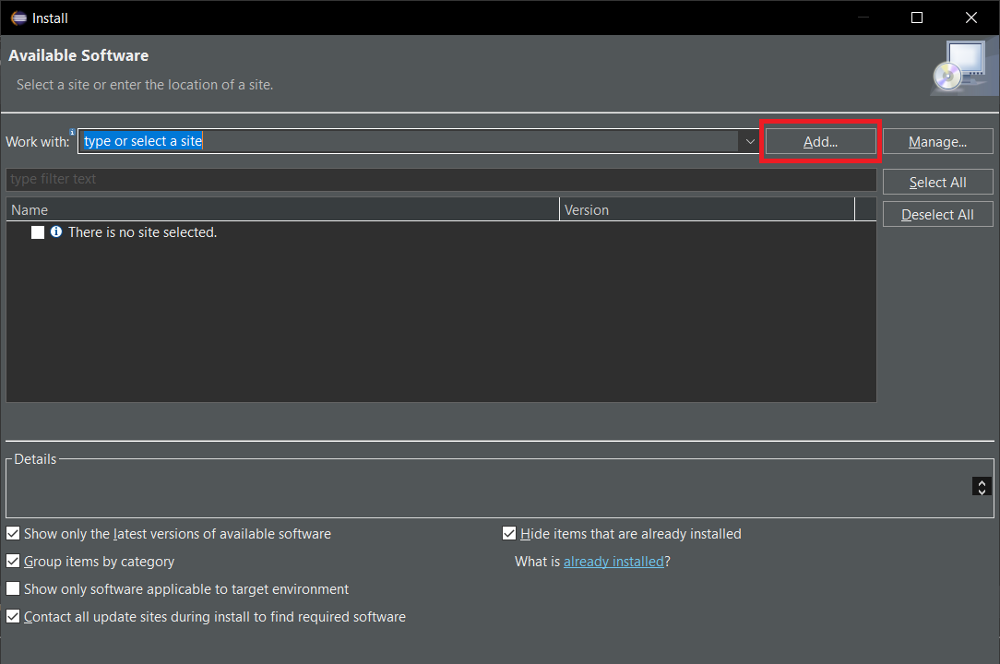
Fill the location with Sirius update site :
http://download.eclipse.org/sirius/updates/releases/7.0.6/2021-06

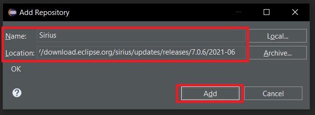

And install all of Sirius plugins.<br>
Finally, for the installation of SonarLint, go to https://marketplace.eclipse.org/content/sonarlint, drag and drop the "Install" button to your Eclipse workspace.


## 2. Development
### 2.1. Versions
These are the versions of the software / plugins used :
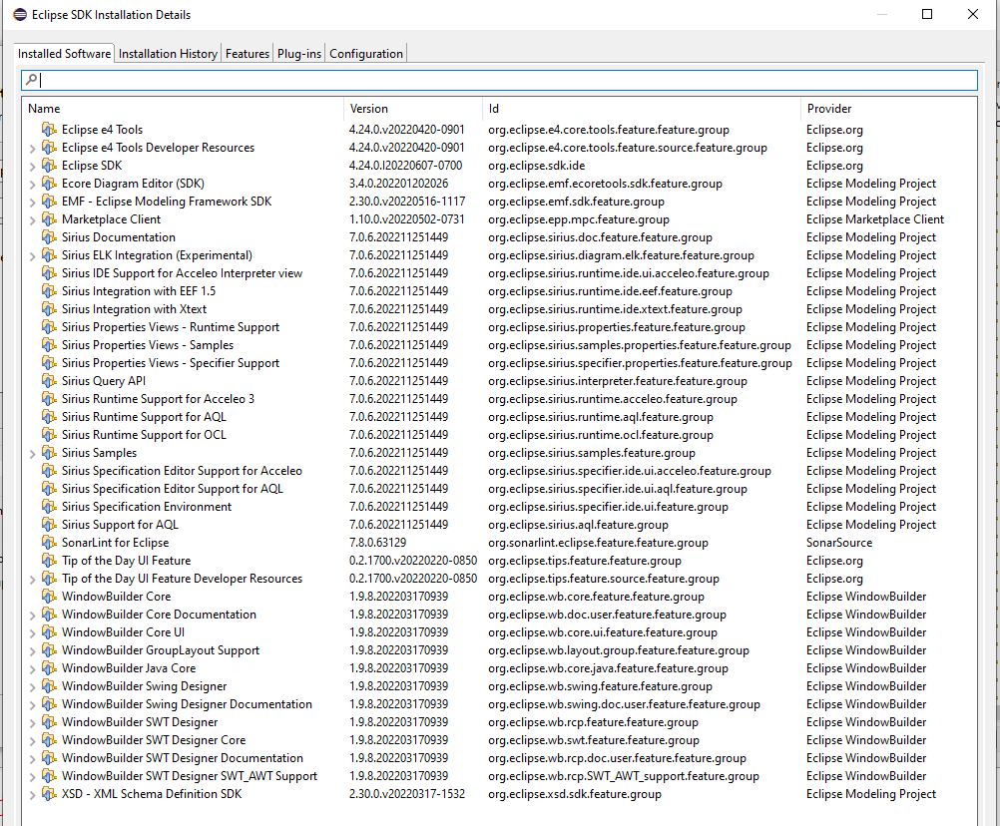  
*Software versions*

### 2.2. EMF
See the design guide.

### 2.3. Eclipse, RCP3 & RCP4 compatibility
The project managing the compatibility layer is `com.dassault.edt.compatibility`.<br>
As an RCP4 application, EDT has all the classes to deal with its lifecycle.<br>
Moreover, to ensure that E3 plugins can be run within EDT, the necessary E3 objects are created. You can see the class `Application`, that creates a "`Workbench`" when it starts and then closes it when it stops.

### 2.4. GUI
The e4xmi files contain the configuration of the visual elements : menus, windows, etc.<br>
Concerning the source code, it's in the project `com.dassault.edt.ui` : for handlers, menus, views, wizards, perspectives etc.

#### 2.4.1. Creating a new menu
The static menu system is declared in the file com.dassault.edt.ui/fragment.e4xmi. This file, once opened, enable the user to create commands, handlers and menuContributions items.

First create a command, for  example name it "Partial Import", then create a handler. Prior to handler declaration its implementation class stub must be created. You can use the class ImportProjectHandler.java as an example. Creating handlers might imply creating Wizards, see code for details.

Once a handler is created, a menuContribution can be added to the menu :
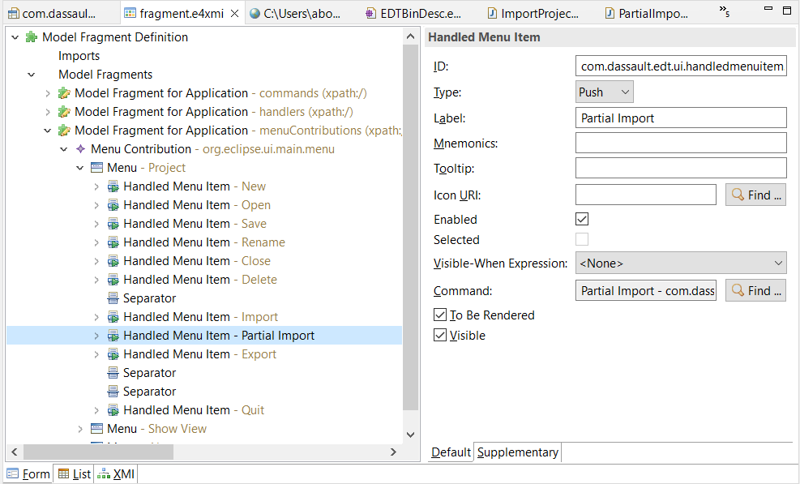

### 2.5. Log
In the project `com.dassault.edt.log` a logger is created, it can log in the console view, and / or display a message in a pop-up.

### 2.6. Import
#### 2.6.1 Java class
`XmlImporter`, `XMLImporterExtracter` and `XMLImporterSecondaryExtracter` in `com.dassault.edt.import`.

For partial import :  `PartialImporter` in com.dassault.edt.partialimport

#### 2.6.2 Pre-requisites

- ECOA model is the model used to import existing xml.
- Sirius uses the EDT model that is a modified version of the ECOA model. Thus there is a need to convert ECOA Objects to EDT.

#### 2.6.3 Process
1) The list of files that can be imported can be found in the file [ECOA-standard-implementation.md](../ECOA%20Standard%20Implementation/ECOA-standard-implementation.md)

2) All the main files are then read with EMF and converted from ECOA Objects to EDT Objects.
  When reading the main files the secondary files like *.interface.qos.xml are also imported

- The EDT classes correspond mainly to ECOA classes with String references replaced by Object references.
Though some elements are not readable by Sirius, they had to be modified (i.e. the ComponentType Property attributes and the Composite Component Instance attribute) and some elements were changed for graphic purpose (e.g. OperationLinks and Component Instance).

- To convert the ECOA model to EDT model, the functions are present in `com.dassault.edt.converters`.


3) The EDT Objects are then grouped by folder in the EDT "Steps". See in the file [ECOA-standard-implementation.md](../ECOA%20Standard%20Implementation/ECOA-standard-implementation.md) for more details

#### 2.6.4 How to read an ECOA file with EMF
To read a file with EMF, `Resource` and `ResourceSet` are used.
```java
// Convert file to URI
	URI uri = URI.createFileURI(fileToRead.getAbsolutePath());
// Create ResourceSet
	ResourceSet resourceSet = new ResourceSetImpl();

// Register the appropriate resource factory to handle all file extensions.
	resourceSet.getResourceFactoryRegistry().getExtensionToFactoryMap().put(
		Resource.Factory.Registry.DEFAULT_EXTENSION, new ECOAPACKAGEResourceFactoryImpl());

// Register the package to ensure it is available during loading.
	resourceSet.getPackageRegistry().put(ECOAPACKAGE.eNS_URI, ECOAPACKAGE.eINSTANCE);

// Get the resource from URI/Parse XML
	Resource resource = resourceSet.getResource(uri, true);

// Get main object of the XML
	EObject extractedObject = resource.getContents().get(0);
```
  
- A `ResourceFactoryImpl` is necessary, with XSD based models, there is always one generated, so `ECOAPACKAGEResourceFactoryImpl`, will correspond to the `ResourceFactory` implemented in the package corresponding to the XSD associated to the XML to be read.
- `ECOAPACKAGE.eNS_URI` and `ECOAPACKAGE.eINSTANCE` correspond to the namespace of the package and the instance of the model package. Like the `resourceFactoryImpl`, they are specific to a XSD
- The extracted Object is to be cast to the package `DocumentRoot` object to be usable.  

#### 2.6.5 Main limitations of import :  
EMF is able to import all elements (other than the lang attribute of Documentation explained in the design guide), but Sirius is not able to use elements like `FeatureMap`s, thus when converting to EDT Objects, some informations are lost :  

- all the XML comments
- the Documentation for SCA based XML
- the SCA-extended attributes of the Property (\*.composite and \*.componentType) that are not Library or Types are lost.

Other limitations can be found in the section 'Limitations' of the file [ECOA-standard-implementation.md](../ECOA%20Standard%20Implementation/ECOA-standard-implementation.md).

#### 2.6.6 Partial Import
To access the current project in the application, the following code is used : 
```java
	Session session = new EcoadtServices().getSession();
	Resource next = session.getSemanticResources().iterator().next();
	Steps steps = ((Steps) next.getContents().get(0));
```
To modify the current project, the following code structure is used :
```java
	TransactionalEditingDomain transactionalEditingDomain = session.getTransactionalEditingDomain();
	CommandStack commandStack = transactionalEditingDomain.getCommandStack();
	RecordingCommand recordingCommand = new RecordingCommand(transactionalEditingDomain) {

		@Override
		protected void doExecute() {
			// modification on model
		}
	}
	commandStack.execute(recordingCommand);

```
### 2.7. Export
#### Java class
`XMLExporter` and `XMLExporterHelper` in `com.dassault.edt.export`.

#### Pre-requisites
- Sirius uses the EDT model which is a modified version of the ECOA model.
- ECOA model is the EMF model that can regenerate the different XML in the ECOA style, thus there is a need to convert the instance of EDT model to ECOA model.

#### Process
1) The model.ecoaDT file that corresponds to the EDTProject instance given to Sirius is parsed by EMF. The "Steps" EMF object is retrieved.

2) The "Steps" EObject contains all the ECOAProject elements grouped by folder. See the file [ECOA-standard-implementation.md](../ECOA%20Standard%20Implementation/ECOA-standard-implementation.md) for more details.

3) The different EDT Objects are converted to ECOA Objects by converting all the elements contained in EDT to ECOA. The EDT Classes mainly inherit from the ECOA Classes (and only the XML path and the name are added), consequently in general elements can be simply transfered.
Though some elements are converted to references or are not being readable by Sirius, they had to be modified (i.e the ComponentType Property attributes and the Composite Component Instance attribute) and some elements were changed for graphic purpose (e.g. OperationLinks and Component Instance). These elements require recreating FeatureMaps in general.
- To convert the EDTModel to ECOAModel, the functions are present in `com.dassault.edt.converters`. They use the same mechanism as in the import and are mainly just transfer from EDT Objects to ECOA Objects.
- The EDT Objects all contains their fileName prefix and the step subdirectory is also gettable, thus the file path will be :
`ExportDirectory/StepDirectory/fileName+extension`
- The object that is exported by EMF should be DocumentRoot to keep the NameSpace

4) Export each EcoaModel instance to exportDirectory (given by user) + relative file path (obtained from EDT Objects)
- The namespaces prefixes are not mandatory the same as in original XML, the root prefix are always absent but for the non root elements :
    - for the namespace "http://www.ecoa.technology/sca-extension-2.0", the prefix will be "ecoa-sca"
    - for the namespace "http://docs.oasis-open.org/ns/opencsa/sca/200912", the prefix will be "csa"
    - for the namespace "http://www.w3.org/2001/XMLSchema", the prefix will be "xsd"
    - for all the other namespace, no prefix will be added

#### Problems encountered
- The ECOAModel elements that are not readable by Sirius are extracted to FeatureMaps. These FeatureMaps correspond to a Map<eStructuralFeature,EObject> to be simple. the eStructuralFeature can be obtained through the <EPackageName>.Literals.<name of structure>. To find the name of the structure that is to be used, it is possible to look in debug mode the original EcoaModel elements and look for the name of eStructuralFeature and find the corresponding Literals in the <EPackageNameImpl> initializePackageContents (the name of the eStructuralFeature are given in the initEAttribute and initEReference).

- The OperationLink (ComponentImplementation) have to be converted from aggregated links to simple links to be usable in Sirius. Thus they have to be reaggregated in the export. All operations outside of EventSent can be only in one Link, thus they are the aggregating element : all the links are converted in hashmap, with the key being one of this operation and then the operations are aggregated to have the minimal number of element in multiple links

#### Side notes
##### FeatureMaps
- Instance of Component: `component.getImplementationGroup().add(scaExtPackage.Literals.DOCUMENT_ROOT__INSTANCE, instance);` and Instance is part of the sca-extension package and not the sca package.

- Value of Property (ComponentType and Composite) and PropertyValue (Component) : the "value" attribute is of type "any" in xsd and consequently corresponds to a FeatureMap in the EcoaModel. In the EMF Model, the value corresponds to a ValueType object. And the ValueType object contains the real value in its "mixed" attribute (there is an entry per line of value in the xml, that can be plain text or comments). The recreation of the ValueType use "XMLTypePackage.Literals.XML_TYPE_DOCUMENT_ROOT__TEXT" to recreate the mixed element. After that, the ValueType is added to the property "any" through `property.getAny().add(scaPackage.Literals.DOCUMENT_ROOT__VALUE, valueType);`


##### Miscellaneous
- Our EDT model was not generated from XSD, thus it does not contain a personal ResourceFactory
- the model.ecoaDT is an XMI, not an XML, thus XMIResourceFactoryImpl is to be used
- When the model.ecoaDT is saved by Sirius after modification, the extended metadatas are not saved, thus it is necessary to not set the option XMLResource.OPTION_EXTENDED_META_DATA to true when reading the model. (And the option should also be false for the creation of the file)


#### Main limitations of export :
The limitations can be found in the section 'Limitations' of the file [ECOA-standard-implementation.md](../ECOA%20Standard%20Implementation/ECOA-standard-implementation.md)


### 2.8. Sirius
####  2.8.1 Related plugins
- Design - com.dassault.edt.design
- UI - com.dassault.edt.ui

#### 2.8.2 Pre-requisites
- Sirius plug-in installed in Eclipse
- The project must contain a "Viewpoint Specification Project"
   (com.dassault.edt.design in ECOA Design Tool)

#### 2.8.3 Setup

Sirius views are managed by the .odesign file specific to Sirius contained in the "com.dassault.edt.design" module, corresponding to the Viewpoint Specification Project of ECOA Design Tool.
This file describes the Sirius views contained in the application, as well as all associated metamodels.

All instances of representation are stored in the .aird file, contained in the ECOA projects. This .aird file is automatically created when a project is created or imported into the application.

Here is the function that creates the .aird file when creating/importing a project.

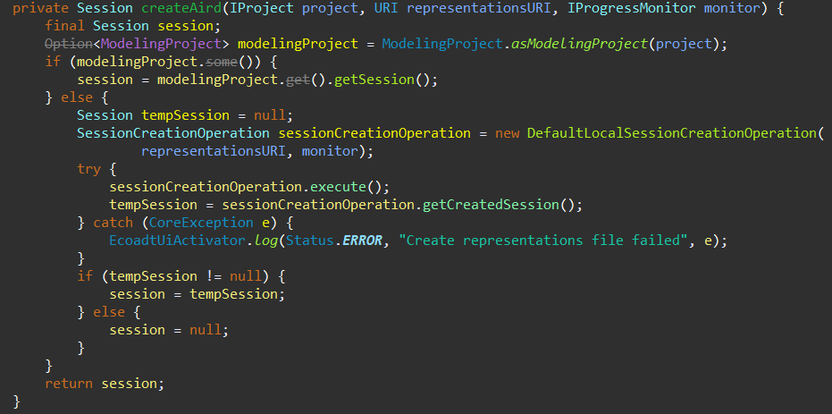

#### 2.8.4 View Creation

##### 2.8.4.1 Create representation

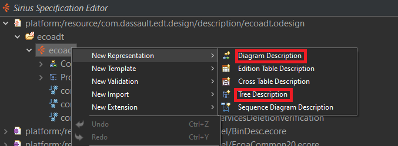

##### 2.8.4.2 Tree View Elements in ECOA Design Tool

 -> Defines the elements that will be displayed.

 -> Defines the actions to perform when creating a new element.

 -> Defines the action to perform when deleting an element.

 -> Allows you to add menus when left-clicking on an item.

##### 2.8.4.3 Diagram View Elements in ECOA Design Tool

 -> Defines the elements that will be displayed.

 -> Defines the elements that will be displayed around a Node.

 -> Defines a link between two nodes.

 -> Create a section in the palette

 -> Add a node creation feature to the section

 -> Add an edge creation feature to the section

 -> Defines the behavior when copying and pasting on an element

 -> Defines the behavior when deleting an element

To understand how to use these concepts, please refer to the Sirius documentation: [Sirius Specifier Manual](https://www.eclipse.org/sirius/doc/specifier/Sirius%20Specifier%20Manual.html)


##### 2.8.4.4 Dynamically create a representation instance

The function that creates the treeview :
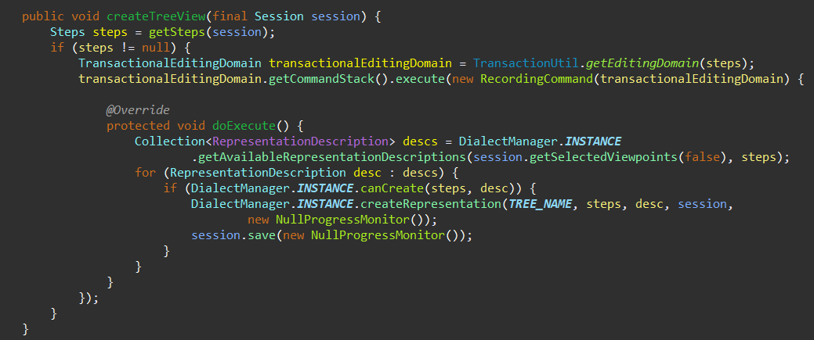

It is necessary to recover the element that will be represented.

Here, it corresponds to the second line: the "steps" object.
Then you have to fill in the name of the representation in the code portion containing the function "DialectManager.INSTANCE.createRepresentation()"

Here, it corresponds to the TREE_NAME variable.
``` java
public static final String TREE_NAME = "Tree View";
```

##### 2.8.4.5 Dynamically delete a representation instance

This function, for example, delete the component implementation representation of the given component implementation :
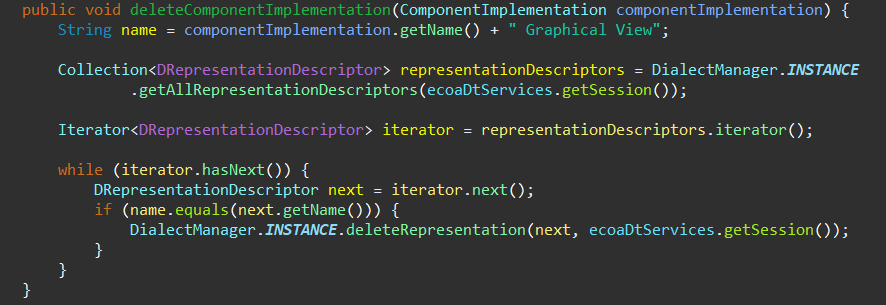

#### 2.8.4.6 Automatic Layout
The Default Layout of Graphical View is not perfect, thus some actions were done to improve it :
1) For the Assembly and ComponentImplementation Graphical Views, the nodes have default size (defined in the ecoadt.odesign and EcoaDtServicesSize.java files in the com.dassault.edt.design package)

2) With the Sirius ELK (Eclipse Layout Kernel) Integration Plugin installed, it is possible to choose other Layout Algorithms and to define custom Layouts.
After a comparison of all proposed layouts, the ELK Layered Layout was choosen as the one improving the most the overlap of the nodes and links.
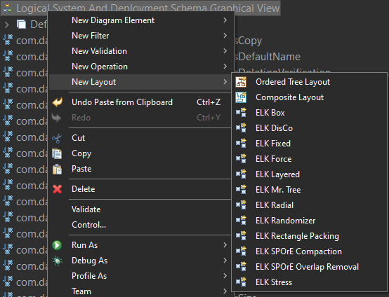.

3) Sirius also allows to override Parameters. The following parameters were overriden :
- For Assembly and ComponentImplementation Graphical Views:
	- Edge Routing : ORTHOGONAL
	- Merge edges : true
	- BK Fixed Alignement : BALANCED
	- Hierarchy Handling : SEPARATE_CHILDREN
- Only for the ComponentImplementation Graphical View : 
	- Node Size Constraints : MINIMUM_SIZE, PORTS


4) The Definition of Layout Algorithm in the odesign affects the Arrange All option (that can be activated by a button in the Graphical Views) and thus is not activated as early as the creation of the Graphical View.
Thus the ArrangeAll is triggered at the creation of the Graphical View through the following code.
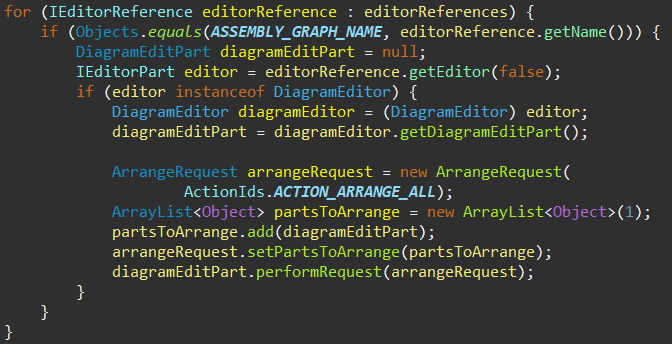

#### 2.8.5 View Display

The function that opens the treeview :
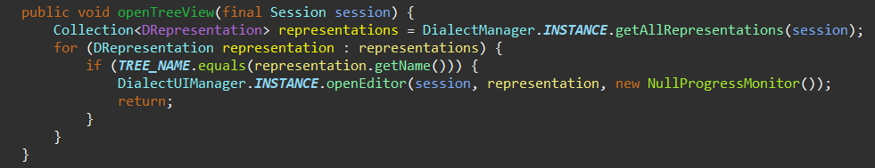

The representation must obviously be created before it is opened.

#### 2.8.6 Miscellaneous
##### 2.8.6.1 Avoid use of External Java Action
Details on Java Services can be found [here](https://blog.obeosoft.com/using-java-services-in-sirius-modelers) and [here](https://www.eclipse.org/sirius/doc/specifier/general/Model_Operations.html#external_java_action)

Java Services are easy to create, but can only be used in fields that expect a return value, for example "Set" operation or "Preconditions" fields.

External Java Action is used to execute a code that does not return anything, but they are more complex to create and use.

One way to use Java Services outside of a "Set" but still in a menu, is to return self in the Java Services and call the Service in "Change Context"

##### 2.8.6.2 Display object in another view
1) Find the view and open it

```java
	/**
	 * Find representation and open it (graphical or tree view)
	 * 
	 * @param name : name of representation to find
	 * @return representation that is now open
	 */
	public DRepresentation findAndOpenView(String name) {

//		Get all Representations 
		Collection<DRepresentation> allRepresentations = DialectManager.INSTANCE
				.getAllRepresentations(service.getSession());

//		Iterate on them
		Iterator<DRepresentation> iterator = allRepresentations.iterator();
		while (iterator.hasNext()) {
			DRepresentation dRepresentation = iterator.next();

//			Search for DRepresentation with correct name
			if (dRepresentation.getName().equals(name)) {

//				Open editor of DRepresentation
				DialectUIManager.INSTANCE.openEditor(service.getSession(),dRepresentation, new NullProgressMonitor());
				return dRepresentation;
			}
		}
		return null;
	}
```

2) Find the object in view

```java
	/***
	 * Find EObject in DRepresentation
	 * 
	 * @param eObject         : object to find
	 * @param dRepresentation : representation that should contain object
	 * 
	 *                        return list of DRepresentationElement that correspond
	 *                        to the eObject
	 */
	private EList<DRepresentationElement> findInRepresentation(EObject eObject, DRepresentation dRepresentation) {
		EList<DRepresentationElement> findings = new BasicEList<>();
		
//		Get all elements represented
		EList<DRepresentationElement> representationElements = dRepresentation.getRepresentationElements();
		for (DRepresentationElement dRepresentationElement : representationElements) {
			
//			Add to list only DRepresentationElement that target EObject
			if (dRepresentationElement.getTarget().equals(eObject)) {
				findings.add(dRepresentationElement);
			}
		}
		return findings;
	}
```

In the case of the Tree View, it is more complicated : due to the lazy loading mode of the Sirius Tree View, to find the object, they need to be "visible", thus their parent node must be expanded. To avoid having to expand all nodes manually, the search is recursive : if the object is not found, its container (eObject.eContainer()) is searched and so on. When the container node is found, it is expanded programmatically, thus its child are "visible" and the object can normally be found in the children.

Another problem is that each node of the Tree View must be associated to an EObject, but for readability reasons, sometimes there is a need to have "folder nodes" (for examples the Operations are always bundled by type of operation). Those "folder nodes" have the container object as Domain Class. Thus it is not always sufficient to have found the Container node, it can be necessary to automatically expand all the children until the object node is found.

3) Select object
```java
	DialectEditor editor = SessionUIManager.INSTANCE.getUISession(service.getSession())
						.getEditor(dRepresentation);

	DialectUIManager.INSTANCE.setSelection(editor, findInRepresentation);

```

##### 2.8.6.3 Expand node of Tree View
```java 
	/**
	 * Expand DTreeItem (Tree View Node)
	 * 
	 * @param dt : tree node
	 */
	protected void expandDTreeItem(DTreeItem dt) {
		/* Get TransactionalEditingDomain to launch command */
		TransactionalEditingDomain domain = service.getSession().getTransactionalEditingDomain();
		CommandStack commandStack = domain.getCommandStack();

		/* Need context */
		GlobalContext globalContext = new TreeRefreshContext(service.getSession().getModelAccessor(),
				service.getSession().getInterpreter(), service.getSession().getSemanticResources(),
				service.getSession().getTransactionalEditingDomain());

		/* Create Command */
		CompoundCommand expandDTreeItemCmd = new CompoundCommand(
				MessageFormat.format(Messages.DTreeItemExpansionChangeCommand_expandItem, dt.getName()));

		/* Add expand command */
		expandDTreeItemCmd.append(
				new DTreeItemExpansionChangeCommand(globalContext, domain, dt, new NullProgressMonitor(), true));

		/* Refresh command */
		SiriusCommand siriusCommand = new SiriusCommand(domain);
		siriusCommand.getTasks().add(new RefreshTreeElementTask(dt));
		expandDTreeItemCmd.append(siriusCommand);

		/* launch command */
		commandStack.execute(expandDTreeItemCmd);
	}
```
##### 2.8.6.4 Collapse node of Tree View
The collapse is similar to the expand, but with DTreeItemExpansionChangeCommand "expand" parameter to false.

##### 2.8.6.5 Actions on save
Some coherence and consistency verification are done when saving the project. 
A SessionListener was used to know when the project is saving and launch verifications
``` java
SessionListener sessionListener = new SessionListener() {

	@Override
	public void notify(int changeKind) {
		if (changeKind == SessionListener.SYNC) {
			EcoadtServices service = new EcoadtServices();
			Steps edtProject = service.getEDTProject();
			if (edtProject != null) {
				EDTProjectValidator.checkSteps(edtProject);
			}

		}

	}
};
EcoadtServices service = new EcoadtServices();
service.getSession().addListener(sessionListener);
```

### 2.9. External plugins
EDT provides the ability to load external plugins. Those plugins are mainly handled in the class `ExternalPLuginsLoader` of `com.dassault.edt.ui`.
If a developer wants to add their plugin to EDT, they have to :
- put the plugin's jar in the directory ~/Ecoa/EDTPlugins.
- write the plugin's name in the file ~/Ecoa/EDTPlugins/plugins.ini.
- write the information about how to access the plugin from the GUI (menu option etc.) in the file ~/Ecoa/pluginsBind.ini.

## 3. Code quality
SonarQube and SonarLint, its Eclipse plugin, are used to check the code's quality.
- SonarQube can be used by anyone with access to the project.
- SonarLint can be used by a developer using Eclipse as an IDE.
## 3.1. SonarQube
First, on a SonarQube server accessible via its website, we created a project, EDT, and we associated to this project a set of rules for the Java language.
How to launch an analysis from the server :
- Download, install and configure SonarScanner in your workstation. See https://docs.sonarqube.org/latest/analyzing-source-code/scanners/sonarscanner/.
- Create a file named "sonar.bat" at the root folder of EDT project, and paste the following content in it :
```
sonar-scanner.bat -D"sonar.projectKey=<EDT-project-key>" -D"sonar.sources=.\ECOA-DT\plugins\com.dassault.edt.compatibility,.\ECOA-DT\plugins\com.dassault.edt.design,.\ECOA-DT\plugins\com.dassault.edt.export,.\ECOA-DT\plugins\com.dassault.edt.import,.\ECOA-DT\plugins\com.dassault.edt.log,.\ECOA-DT\plugins\com.dassault.edt.ui" -D"sonar.java.binaries=.\ECOA-DT\plugins\com.dassault.edt.compatibility,.\ECOA-DT\plugins\com.dassault.edt.design,.\ECOA-DT\plugins\com.dassault.edt.export,.\ECOA-DT\plugins\com.dassault.edt.import,.\ECOA-DT\plugins\com.dassault.edt.log,.\ECOA-DT\plugins\com.dassault.edt.ui" -D"sonar.host.url=<your-EDT-sonar-host-url>" -D"sonar.login=<your-token>"
```
- Replace <EDT-project-key>, <your-EDT-sonar-host-url> and <your-token>, by the right values.
- Launch sonar.bat, and when it's over, go to the website, select the EDT project, and then click on "Issues".

There might be a list of bugs, code smells (major and critical) to correct.
If you choose not to correct one, click on "Open" then select "Resolve as won't fix" and enter a comment on the reason why you choose not to fix it.

The objective is : no bug, no major or critical issue.

## 3.2. SonarLint
See [§ 1.3.](#eclext) for SonarLint installation.
## 3.2.1. Bind SonarLint
Open the view "SonarLint bindings".
- Enter your SonarQube website's URL,
- Enter your credentials (login + password or token),
- Enter your project's name (in our case, EDT).
Then bind the eight following projects to the plugin :
- com.dassault.edt.compatibility
- com.dassault.edt.design
- com.dassault.edt.export
- com.dassault.edt.import
- com.dassault.edt.partialimport
- com.dassault.edt.log
- com.dassault.edt.runtime.feature
- com.dassault.edt.ui

The other projects' Java classes are generated by EMF, so we have no control over the code.

## 3.2.2. Check your code
You have 2 ways to check your code :
- You can right-click on a project (or a group of selected projects) and select "SonarLint / Analyze". The result goes into the "SonarLint Report" view.
- When you write some code, SonerLint analyzes it and the result appears on the "SonarLint On-The-Fly" view.
## 3.2.3. "Clean" your code
If you click on an issue on the report or on-the-fly view, you can see a description on the "SonarLint Rule Description" view.<br>
If you double-click, the focus goes to the corresponding line in your code.<br>
After you change your code and save, you should see the issue disappear.<br>
Finally, you can choose to deactivate a specific rule : [Turning issues off](https://docs.sonarqube.org/latest/analyzing-source-code/languages/java/#turning-issues-off).

## 3.2.4 Proof of "clean" code
The proofs can be found in the file [code-review.md](../Code%20Review/code-review.md). 


The following Steps were followed : 
1) Two screenshots were taken : the overview and the issues tabs.
2) The screenshots and the justification in case of non treated issues were added to the [code-review.md](../Code%20Review/code-review.md).


## 4. Build
Eclipse has an internal compiler, that automatically builds the code.
During the development, you can launch the application from the product file (com.dassault.edt.compatibility.product), by clicking on "Launch an Eclipse application".
## 5. Test
Manual tests have been written to test the project's TOR requirements. They are in a "TOR TC" (test cases) and the results of the tests are in a TOR TR (test results).
## 6. Export as a standalone application
This part describes the process of exporting the product from Eclipse as an executable.
You can either need to generate an executable for your environment only, or for several platforms (or a platform different than yours).
### 6.1. For your environment
### Build files
Check that each internal plugin in the project contains a valid "build.properties" file.
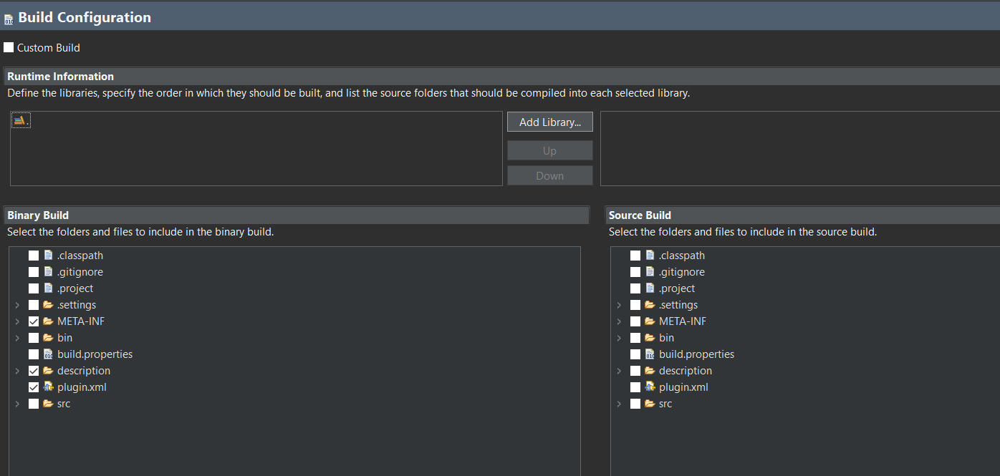
Check that the "icons" folder is included in the build of the UI plugin.

### Eclipse Product export wizard
Open the product file contained in the "compatibility" plugin.
Select "Eclipse Product export wizard"
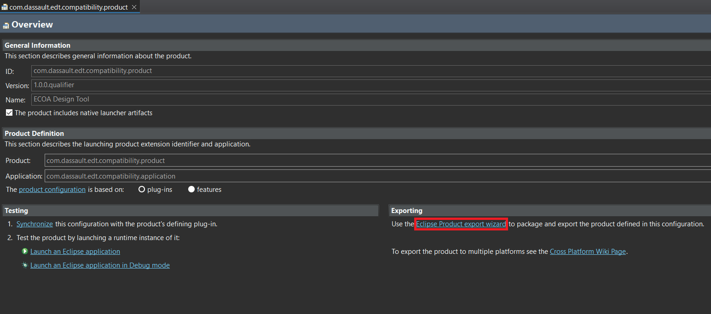
Choose a destination folder and check the box "Generate p2 repository".

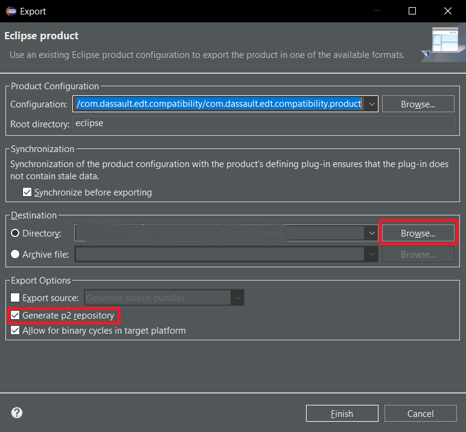

You can click on "Finish".

### Export configuration of Eclipse
1) Go in the Help Menu (1) of Eclipse and click on About Eclipse SDK (2)
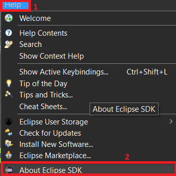

2) In the About Eclipse SDK window that opened, click on Installation Details (3)


3) In the Eclipse SDK Installation Details window that opened, open the Configuration tab (4). The configuration can be copied to the clipboard (5). The configuration was copied to a text file name "ECOA Design Tool vX.X_configuration.txt", with "X.X" being the version of the Tool
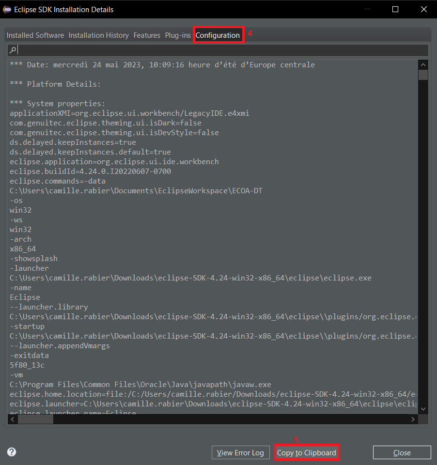


### 6.2. For several platforms
To be able to create an executable for one or several of the following platforms :
- windows,
- linux,
- mac,

you need to follow the instructions at the page https://wiki.eclipse.org/A_Brief_Overview_of_Building_at_Eclipse#Cross-platform_build. See the paragraph "Multi-platform builds".

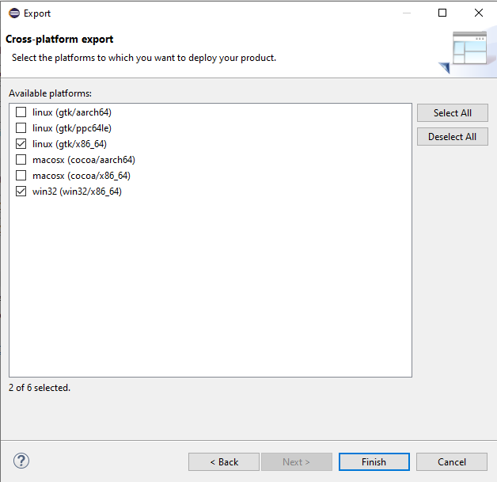
*You can select the platforms to export to*.

Be aware that you might have to add some plugins for the software to work in a specific platform. For example, in the case of linux (gtk/x86_64), due to the specifities of SWT, the following plugins have been added to the product :

      <plugin id="org.eclipse.equinox.launcher.gtk.linux.x86_64" fragment="true"/>
      <plugin id="org.eclipse.swt.gtk.linux.x86_64" fragment="true"/>
      <plugin id="org.eclipse.swt.gtk.linux.x86_64.source"/>

### 6.3 Problems encountered
1) If the following error is encountered : `eclipse\plugins\org.eclipse.pde.build_XXX\scripts\genericTargets.xml:240: A problem occured while invoking the director.`

a. This error can appear if the export directory is not empty.

b. If the problem is not solved, you can modify the genericTargets.xml : 
Under 
```
<!-- Invoke the p2 director to perform an install  -->
<target name="runDirector" >
```

Add the line :
 `<record name="enterPathForGeneratedLogFile" loglevel="verbose"/>`

That line will generate a detailled log file of that are the errors.

2) Some files in the repository have long name, if when pulling a error message appears about a "filename too long", you can use the following command line in your console:

`<git config --globalcore.longpaths true>`
