# ECOA Design Tool User Guide

Copyright 2023 Dassault Aviation

MIT License (see LICENSE.txt)


ECOA Design Tool is a graphical editor that assists in the design of an ECOA system (breakdown into components, breakdown into modules, etc.) and generates the associated ECOA XML files.

This document and use of ECOA Design Tool assume that reader is proficient in the ECOA standard.
For more information about ECOA you can visit: http://www.ecoa.technology/.

The ECOA Standard implemented in the ECOA Design Tool v1.0 is detailed in the file [ECOA-standard-implementation.md](../ECOA%20Standard%20Implementation/ECOA-standard-implementation.md)

## 1. Installation

### 1.1 Windows

#### 1.1.1 Pre-requisites
* Windows 10 1909 or higher
* Java Development Kit 17
* EXVT

#### 1.1.2 Installation
* Copy the ECOA Design Tool files to your computer:

   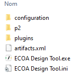

* Edit the "ECOA Design Tool.ini" file by adding the -vm option to specify the path to the javaw.exe file available in JDK 17.

   For example:

      -vm
      C:\Program Files\Java\jdk-17\bin\javaw.exe

   Nota: you must respect the line break between "-vm" and the path to the "javaw.exe" file

### 1.2 Linux

#### 1.2.1 Pre-requisites
* Admin access (sudo)

#### 1.2.2 Install Java 17 (OpenJDK 17) for Debian 9/10
* Make sure to have wget and curl
   ```shell
   sudo apt update
   sudo apt -y install wget curl
   ```
* Download the Java SE Development Kit 17 package
   ```shell
   wget https://download.oracle.com/java/17/latest/jdk-17_linux-x64_bin.deb
   ```
* Then install the DEB package using the apt command
   ```shell
   sudo apt install ./jdk-17_linux-x64_bin.deb
   ```
* Agree to installation when prompted

#### 1.2.3 Installation
See § 1.1.2 Installation

Path to the jdk should be
```
-vm
/usr/lib/jvm/jdk-17/bin/java
```
Make sure the "ECOA Design Tool" is executable
```shell
chmod +x ECOA\ Design\ Tool
```

## 2. Run and close ECOA Design Tool

### 2.1 Run ECOA Design Tool

#### 2.1.1 Windows
   Run the "ECOA Design Tool.exe" executable from Windows

#### 2.1.2 Linux
   Run the "ECOA Design Tool" executable from terminal
   ```shell
   ./ECOA\ Design\ Tool
   ```

### 2.2 Close ECOA Design Tool
Use the "Project->Quit" menu or the main window cross

## 3. Management of the ECOA Projects

From the ECOA Design Tool "Project" menu.

|Menu|Description|
|:--------|:---------|
|New|Create a new ECOA Design Tool project in an ECOA Design Tool workspace|
|Open|Open an existing ECOA Design Tool project from an ECOA Design Tool worksapce|
|Save|Save the current ECOA Design Tool project in an ECOA Design Tool workspace|
|Rename|Rename the current ECOA Design Tool project in an ECOA Design Tool workspace|
|Close|Close the current ECOA Design Tool project|
|Delete|Delete the current ECOA Design Tool project from the file system|
|Import|Import an existing ECOA project from XML files|
|Partial import|Add a subset of ECOA XML files to the current EDT project|
|Export|Export the current ECOA Design Tool project to XML files|
|Quit|Exit EDT|

### 3.1. New project
The user can create a new project by selection the menu "Project / New".

#### 3.1.1. Project Creation
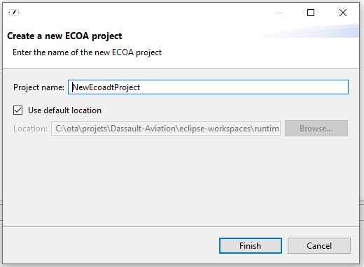

A default project name is filled in. The user can change it.<br>
The user can either :
- Save the new project in a default location, which is the default workspace containing all the user's projects,
- Or select another folder in the file system via the "Browse" button.

NB :
- If another project was opened before the user selects "Project / New", and there were unsaved changes, EDT asks the user if he wants to save his work before proceeding. Only one project is opened in EDT at a time, so the previous project is closed, if any.
- The project's name has to be unique in a given folder. Otherwise, the "Finish" button is disabled.
- If the "Use default location" checkbox is selected, the "Browse" button is disabled (the default location is not editable).

When the user clicks the "Finish" button, the project is created in the selected workspace and then opened in EDT.

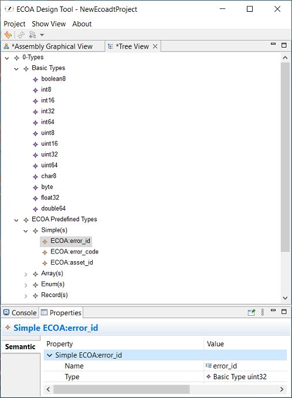

#### 3.1.2. EDT objects creation
**Note** : the user can import an existing ECOA XML project, see below [paragraph 3.7 "Import a project"](#import). He will then have a set of objects, already created from the XML files, in his EDT project.

The user can also create everything from scratch, this is what we cover in the current paragraph.

Once an EDT project is created, the user can follow the following steps to populate it :
- The ECOA Basic Types and Predefined Types are already created and available (in the tree view, under "0-Types". See image above). The user cannot add a new basic type.
- The user can create libraries with types : in the tree view, right click on "0-Types", select "Create / New Namespace ) :

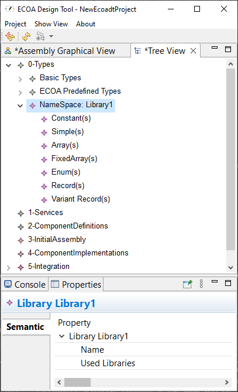

Every EDT object can have properties, every property can have a value. When an object is selected, for example in the tree view, its properties appear in the the "Properties" view. they can be changed there. In our case (see image above), the library has a default name that the user can change in the properties view.

Once the library is created, the user can create types inside it : right click in "Library1" and select "Create" and the right type :

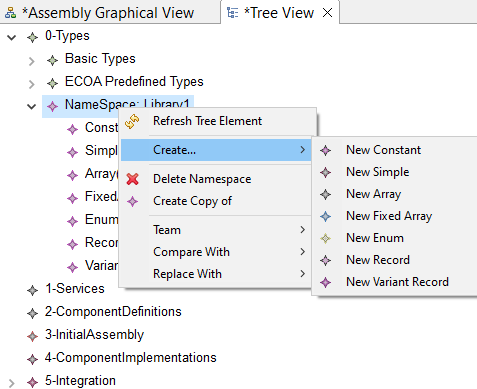

Or right click on a type, for example "Constant" and select "Create / New Constant".
Once the constant is created, go to the properties view and update the values you want : in our case, at least the name, the type (one of the types defined in the project, could be a basic type or a type you created), and the value.  

- The user has then to create service definitions (in the tree view, under "1-Services").
Each service definition has operations. The operations can be :
   - VersionedData,
   - Event (sent by provider or received by provider),
   - RequestResponse.


- The user has then to create component definitions and if necessary their QoS (in the tree view, under "2-ComponentDefinitions") :

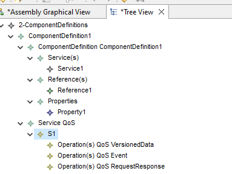


- The next step is the initial assembly : the user has to create components in the "Assembly Graphical View" :

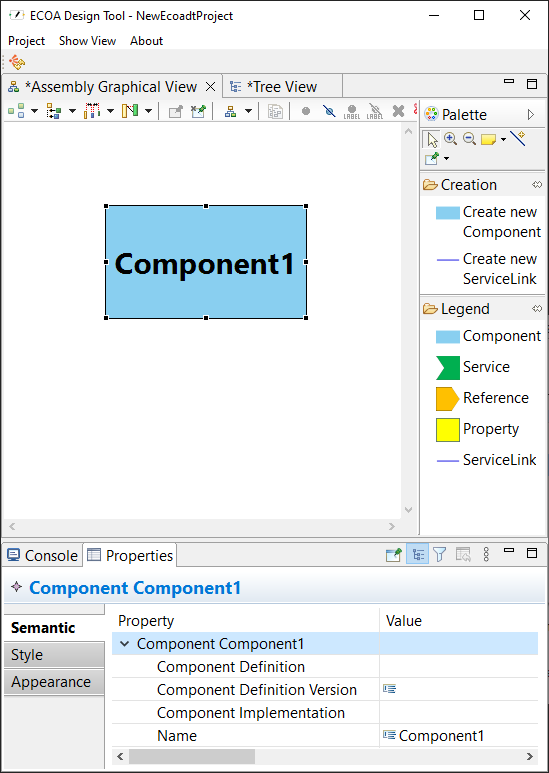

To create a component click on "Create new Component" on the Palette on the right, and drag-and-drop it in the left window. Then as usual update the component's properties in the Properties view.
When you select a component definition, its characteristics are automatically applied to the component :

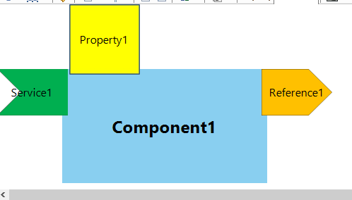

From the palette you can also create a service link : click on "Create new Service Link", click on a reference, then click on a service.

If the user goes back to the tree view, he can see that the created components appear under "3-InitialAssembly", in a "Composite" object.

- The next step is to **create component implementations**. The creation is done in the tree view, under "4-ComponentImplementations", in the tree view order :

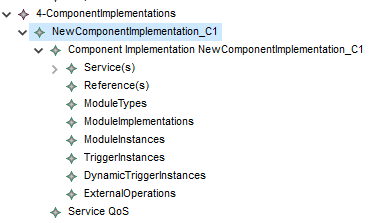


Then the links can be created in a graphical view : right click on the component implementation, select "Open / <name_of_the_component_implementation> Graphical View".

Here is an example of a component implementation graphical view, after the links and operations creation :

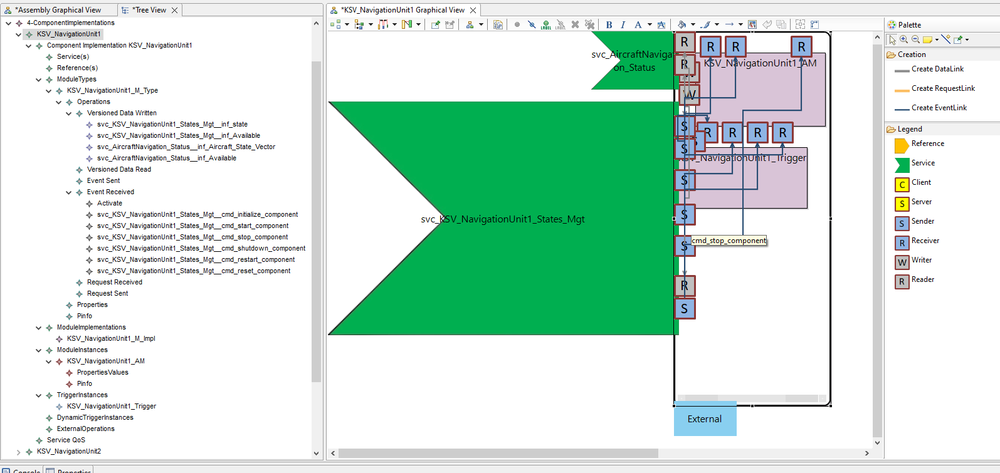

> You can see in the above image :
> - In the palette, the links and operations you can create,
> - In the graphical view, the objects originating from the tree view,
> - In the tree view, the objects created.

<a id="OperationLinkRestriction"></a>
There are some restrictions on the creation of OperationLinks
- For DataLinks :
   - The Versioned Data Operations linked must have the same type.
- For RequestLinks : 
   - The number of inputs and outputs of the linked Request Response Operations must be equals.
   - The types of the inputs/outputs must be the same between the client and the server operation. Thus the order of inputs and outputs are important.
- For EventLinks :
<table class="tg">
<thead>
  <tr>
    <th class="tg-0pky"></th>
    <th class="tg-0pky">EventSent<br><span style="font-weight:bold;text-decoration:underline">From </span>: ModuleInstance</th>
    <th class="tg-0pky">Event <br><span style="font-weight:bold;text-decoration:underline">From </span>: Required Service<br><span style="font-weight:bold;text-decoration:underline">Direction </span>: SENT_BY_PROVIDER </th>
    <th class="tg-0pky">Event<br><span style="font-weight:bold;text-decoration:underline">From</span><span style="text-decoration:underline"> </span>: Provided Service<br><span style="font-weight:bold;text-decoration:underline">Direction </span>: RECEIVED_BY_PROVIDER</th>
    <th class="tg-0pky">Event Sender<br><span style="font-weight:bold;text-decoration:underline">From</span><span style="text-decoration:underline"> </span>: external</th>
    <th class="tg-0pky">Event Sender 'out'<br><span style="font-weight:bold;text-decoration:underline">From </span>: Dynamic Trigger Instance</th>
    <th class="tg-0pky">Event Sender<br><span style="font-weight:bold;text-decoration:underline">From </span>: Trigger Instance</th>
  </tr>
</thead>
<tbody>
  <tr>
    <td class="tg-0pky">EventReceived<br><span style="font-weight:bold;text-decoration:underline">From </span>: ModuleInstance</td>
    <td class="tg-f8tv">- Number of inputs must be equal<br>- Types of inputs of Receiver and Sender must be the equal in the same order<br></td>
    <td class="tg-f8tv">- Number of inputs must be equal<br>- Types of inputs of Receiver and Sender must be the equal in the same order<br></td>
    <td class="tg-f8tv">- Number of inputs must be equal<br>- Types of inputs of Receiver and Sender must be the equal in the same order<br></td>
    <td class="tg-f8tv">No restriction</td>
    <td class="tg-f8tv">- The number of Receiver inputs must be equal to the number of Dynamic Trigger Instance parameters<br>- The Receiver inputs must be equal to the Dynamic Trigger Instance parameters in the same order<br></td>
    <td class="tg-f8tv">Receiver with no inputs</td>
  </tr>
  <tr>
    <td class="tg-0pky">Event <br><span style="font-weight:bold;text-decoration:underline">From </span>: Required Service<br><span style="font-weight:bold;text-decoration:underline">Direction </span>: RECEIVED_BY_PROVIDER </td>
    <td class="tg-f8tv">- Number of inputs must be equal<br>- Types of inputs of Receiver and Sender must be the equal in the same order<br></td>
    <td class="tg-0680">Not possible</td>
    <td class="tg-0680">Not possible</td>
    <td class="tg-hmkg">Not possible</td>
    <td class="tg-f8tv">- The number of Receiver inputs must be equal to the number of Dynamic Trigger Instance parameters<br>- The Receiver inputs must be equal to the Dynamic Trigger Instance parameters in the same order<br></td>
    <td class="tg-f8tv">Receiver with no inputs</td>
  </tr>
  <tr>
    <td class="tg-0pky">Event<br><span style="font-weight:bold;text-decoration:underline">From</span><span style="text-decoration:underline"> </span>: Provided Service<br><span style="font-weight:bold;text-decoration:underline">Direction </span>: SENT_BY_PROVIDER</td>
    <td class="tg-f8tv">- Number of inputs must be equal<br>- Types of inputs of Receiver and Sender must be the equal in the same order<br></td>
    <td class="tg-0680">Not possible</td>
    <td class="tg-0680">Not possible</td>
    <td class="tg-hmkg">Not possible</td>
    <td class="tg-f8tv">- The number of Receiver inputs must be equal to the number of Dynamic Trigger Instance parameters<br>- The Receiver inputs must be equal to the Dynamic Trigger Instance parameters in the same order<br></td>
    <td class="tg-f8tv">Receiver with no inputs</td>
  </tr>
  <tr>
    <td class="tg-0pky">Event Receiver 'in'<br><span style="font-weight:bold;text-decoration:underline">From </span>: Dynamic Trigger Instance</td>
    <td class="tg-f8tv">- The number of Sender inputs must be : 1 + number of Dynamic Trigger Instance parameters<br>- The first Sender input must be of 'ECOA:global_time' type<br>- The following Sender inputs must be equal to the Dynamic Trigger Instance parameters in the same order<br></td>
    <td class="tg-f8tv">- The number of Sender inputs must be : 1 + number of Dynamic Trigger Instance parameters<br>- The first Sender input must be of 'ECOA:global_time' type<br>- The following Sender inputs must be equal to the Dynamic Trigger Instance parameters in the same order<br></td>
    <td class="tg-f8tv">- The number of Sender inputs must be : 1 + number of Dynamic Trigger Instance parameters<br>- The first Sender input must be of 'ECOA:global_time' type<br>- The following Sender inputs must be equal to the Dynamic Trigger Instance parameters in the same order<br></td>
    <td class="tg-f8tv">No restriction</td>
    <td class="tg-hmkg">Not possible</td>
    <td class="tg-hmkg">Not possible</td>
  </tr>
  <tr>
    <td class="tg-0pky">Event Receiver 'reset'<br><span style="font-weight:bold;text-decoration:underline">From </span>: Dynamic Trigger Instance</td>
    <td class="tg-f8tv">Sender with no inputs</td>
    <td class="tg-f8tv">Sender with no inputs</td>
    <td class="tg-f8tv">Sender with no inputs</td>
    <td class="tg-f8tv">No restriction</td>
    <td class="tg-hmkg">Not possible</td>
    <td class="tg-f8tv">No Restriction</td>
  </tr>
</tbody>
</table>


**Note** : the operations names are not visible by default. When the mouse hovers an operation, its name is displayed on a tooltip (example on the image : cmd_stop_component).

**Note2** : In some cases, the TriggerInstance or DynamicTriggerInstance can be hidden in the graphical view. You can use the Search function (Ctrl + o) to find it.

**Note3** : the automatic layout of the operations or services can require to click on arrange all () on the tool bar. See [paragraph 5.4 "Tool Bar"](#toolBar)

- Binary description can be useful in giving dimensioning elements like memory size. Binary description can be found at the same level as Service QOS in the tree view in "4-ComponentImplementations"

A user can create a binary description as part of a component implementation to allow the user to link component implementation to binary files :

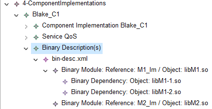

Multiple binary description can be specified, they are distinguished by their name (here "bin-desc.xml").

When you associate the initial assembly components to component implementations, the final assembly appears in the tree view, under "5-Integration".

- Under "5-Integration", you can create 
   - a "Logical system" and a "Deployment". With a right click on the logical system or Deployment Schema in the tree view, you can open the "Logical System and Deployment Schema Graphical View", that contains both objects.


   - One or more UDP Binding that can be associated to Logical Computing Platforms through their "Transport Binding Parameters" attribute.
   - One or more ID Map (Association between IDs and wires) to give IDs to Operations involved in Service Links.
### 3.2. Open a project
The user can select "Project / Open" to open an existing project.<br>

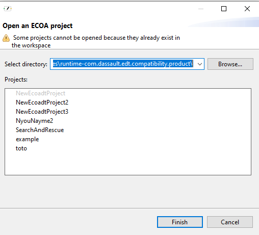

If another project was opened before the user selects "Project / Open", and there were unsaved changes, EDT asks the user if he wants to save his work before proceeding. Only one project is opened in EDT at a time, so the previous project is closed, if any.

The user can select the directory where the project is located (the workspace). If one of the workspace's projects is the one opened in EDT, it is disabled in the projects list, and a warning is displayed (see image).

### 3.3. Save a project
To save his changes, the user can select "Project / Save", or hit "Ctrl + S". When saving, some on-the-fly verifications are done, in particular on missing attributes.

### 3.4. Rename a project
The user can rename a project, he just has to enter the new project's name.
Its workspace folder is also renamed.

### 3.5. Close a project
The user can close the current project. If he does, EDT is opened with no project.

### 3.6. Delete a project
The user can delete the currently opened project.
Warning : this operation cannot be undone.

### 3.7. <a id="import"></a>Import a project
The user can import an "ECOA XML project". It creates an EDT project that becomes independant of the XML files.

#### 3.7.1. The wizard
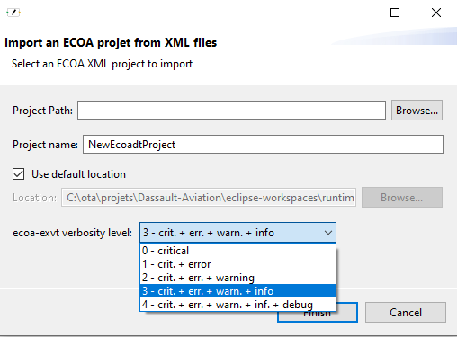

EDT can only import ECOA projects containing a file with the extension ".project.xml".<br>
At first there is a default project name. This name changes when the user selects a ".project.xml" file. The new name is the file's name without the extension, and the user can still change it if he wants.<br>
Note : the "Browse" button's purpose is to help select a .project.xml file. It is not related to the "Project Path" field. So if the user pastes a path into this field, it has no effect on the pre-selected folder of the "Browse" button.

On the other hand, if the user pastes into the "project path" a path to a .project.xml file, and then hits "Enter", the import is then launched with this information taken into account.

The user can choose the location of the project :
- The default location is selected by default and is not editable.
- If the user unselects the "Use default location" checkbox, he can select another folder.

Finally, the user can choose the verbosity level of EXVT.

#### 3.7.2. The import
If the user chooses a project name that already exists in the workspace, there are 2 scenarios :
- If the existing project is opened, an error message asks the user to choose another name for the project, so that it is created in another folder.
- If the existing project is not opened, EDT asks to overwrite (or not) the "old / current" project.

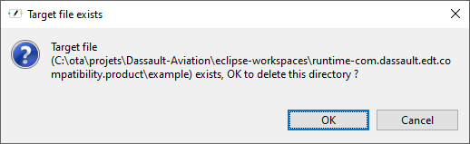

If the user cancels, he is back to the wizard. If he confirms, the old project is deleted and replaced by the new one.

Before the import, there is a first level of validation : EXVT is used to validate the XML files from a technical (XSD) and a functional (legality rules) point of view.
EXVT validates every step of an ECOA project. So :
- if EXVT doesn't detect any error, all the steps are going to be imported.
- If EXVT detects an error in a given step, then EDT imports all the steps before. If EXVT detects an error in the first step, an empty project is created. 

There is a second level of validation from EDT : after EXVT, if EDT detects an error not detected by EXVT, the import fails, there is no project creation.

The import results are logged, in the console and in a log file :
- EXVT messages,
- EDT messages.
In addition, pop-ups are shown if there are limitations to the import (for example if EDT doesn't allow the import of a given file present in the ECOA XML project).

### 3.8. Partial import
The aim here is to add to the current project a subset of ECOA XML files.
Here is how it works :
1) The user has an ECOA Design Tool project opened and wants to add new file(s).
2) The user selects an ECOA project.xml file listing the files to import.
3) The listed files are imported if :
- The current project is valid (EXVT verification)
- The adding of new file does not create inconsistencies (EXVT verification)

__Note 1__ : if the project.xml lists files that are already present, they will not be imported. The partial import does not merge files.
__Note 2__ : Only Namespaces, Service Definitions, Component Definitions (with their Service QoS), Component Implementations (with their Service QoS and Binary Description) and ID Maps can be imported this way.   


### 3.9. Export a project
The user can export an EDT project : EDT creates an ECOA XML project, independant of the original EDT project.<br>
A wizard allows the user to select the folder where the project will be exported, and EXVT verbosity level (after the project generation and before the export, EXVT checks its consistence).

If EXVT finds an inconsistence, the project is exported anyway, and EXVT messages are logged in the console :

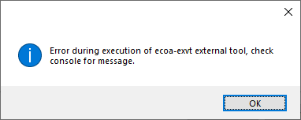


## 4. Management of the ECOA Design Tool windows

### 4.1. The show view menu

From the ECOA Design Tool "Show View" menu.

|Menu|Description|
|:--------|:---------|
|Tree->Open Tree View|Open the Tree View|
|Graph->Open Assembly Graphical View|Open the Assembly Graphical View|
|Graph->Open Logical System & Deployment View|Open the Logical System & Deployment View|
|Properties|Open the Properties view|
|Console|Open the Console view|
|Outline|Open the "God's view"|

### 4.2. overview of the views

As an eclipse RCP application, EDT uses different views to render and make usable an imported ECOA project, it is composed of mainly four different views:
- the tree view
- the graphical view
- the property view
- the outline view

Plus access is given to the console output which is useful in presenting captured import/export exvt external tool validation messages.

Those views are opened by the main menu "Show View", and some graph views may be opened by a tree view component contextual menu.
Views can be arranged to show a kind of mosaic as depicted in the screen capture below.
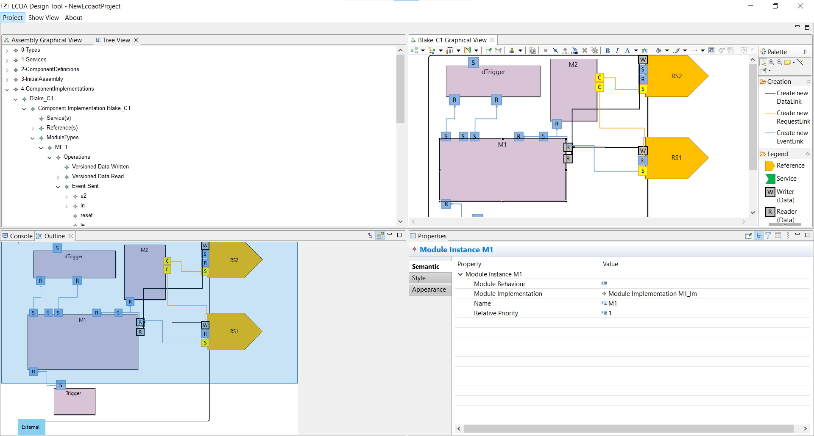

The mouse gestures to spread the views to the corners is simply to grab the tab view label with the mouse and to drag and drop to the concerned corner. When it's ready to receive the view in the new corner you should see translucid borders appearing where the view is to be dropped to.

## 5. Management of the ECOA Objects

The ECOA objects are managed from a Tree or a Graph view.
### Overview
|ECOA Step|Editing approach|Description|
|:--------|:-----|:---------|
|0-Types|Tree|Edit the DataTypes|
|1-Services|Tree|Edit the ServiceDefinitions|
|2-ComponentDefinitions|Tree|Edit the ComponentDefinitions and the ServiceQoS|
|3-InitialAssembly|Graph|Edit the initial AssemblySchema: Components and ServiceLinks|
|4-ComponentImplementations|Tree|Edit the ModuleTypes, ModuleImplementation, ModuleInstances, TriggerInstances, DynamicTriggerInstances|
|4-ComponentImplementations|Graph|Edit the OperationLinks|
|5-Integration|Tree|Edit the LogicalSystem, DeploymentSchema, UDP Binding|
|5-Integration|Graph|Edit the final AssemblySchema: assiociate a Component with a ComponentImplementation|

For more details: see the TOR.

Depending on the Object, some limitations can exist. They can be found in the section 'Limitations' of the file [ECOA-standard-implementation.md](../ECOA%20Standard%20Implementation/ECOA-standard-implementation.md).

### CRUD Management

|Action|Editing approach|Description|
|:--------|:-----|:---------|
Create an object|Tree|Use the menu "Create->New..."|
Create an object|Graph|Use the "Palette" window|
Read an object|Tree|Nothing to do|
Read an object|Graph|Nothing to do|
Update an object|Tree|Use the "Properties" window|
Update an object|Graph|Use the "Properties" window|
Delete an object|Tree|Use the menu "Delete tree item" or hit 'Suppr'on the keyboard|
Delete an object|Graph|Use the menu "Edit->Delete from model" or hit 'Suppr'on the keyboard|

## 5. Possible actions

Using EDT, main editing actions consist of :
- create new objects
- setting properties
- delete object
- create copy of objects
- link objects

The main work is done in the tree view (create/delete/copy), and the graphical view is a visual aid or input tool that comes into play later,  the graphical view is useful in creating links.

## 5.1. Tree view
In addition to what we have already seen, EDT allows several actions, depending on the selected object, thanks to a right click :
- Delete : some objects are deleted if not used somewhere in the project, otherwise an error is displayed and the object is not deleted.
- Create a copy of : creates, at the same level, a copy of the object, that the user can then update.

## 5.2. Properties view
Updates are propagated. For example :
- If the user changes the name of a component definition reference, and a Component inherits from the Component Definition, the modification is propagated to the Component reference.
- If the user adds a property to a component definition, a property is created in the inheriting components, with its default value.

## 5.3. Graphical views
Some objects can be deleted from a graphical view.
  
## 5.4 <a id="toolBar"></a> Tool bar 
For more informations on the tool bar displayed for editor tabs (Tree View and Graphical View), see [Sirius documentation on tab-bar](https://www.eclipse.org/sirius/doc/user/diagrams/Diagrams.html#ref_tabbar).

## 6. Editing facilities

|Editing facility|Editing approach|Description|
|:--------|:-----|:---------|
|Zoom|Graph|Use the mouse wheel while hitting 'ctrl' on the keyboard|
|Element resizing|Graph|Resize any element by stretching the corners or edges|
|Window resizing|Graph|Resize any windows by stretching the edges|
|Panning|Graph|Use the mouse wheel or the scroll bars|
|Copy/Paste|Graph|Use the menu "Edit->cut/copy" on an element to copy then "Edit->paste" or hit 'ctrl+c' then 'ctrl+v' on the keyboard|
|Copy/Paste|Tree|Use the menu "Create copy of" on an element to copy|
|Manual Layout|Graph|The user can arrange the Layout in a graphical view as desired.|
|Automatic Layout|Graph|Nothing to do, this layout is automatically done when a graphical view is opened|
|Layout saving|Graph|Layouts are automatically saved when a project is saved|
|Undo|Graph/Tree|Hit "Ctrl+Z" on the keyboard|
|Redo|Graph/Tree|Hit "Ctrl+Y" on the keyboard|
|Smart Connect|Graph|The wiring is allowed only between a reference instance and a service instance that is sharing the same service definition|
|Smart Connect 2|Graph|Use the menu "Create->All links" to create all links allowed from a service instance|
|Search|Graph|Hit "Ctrl+O" on the keyboard. For Search in Tree View, the search can only be done on expanded nodes.|
|Display|Graph|Right-click in an element selected in a tree view, select "Display in graphical view" : the element is displayed in the associated graphical view is available|
|Expand/Collapse All|Tree|Use the menu Show View -> Expand/Collapse Tree view to expand or collapse all the nodes.|


## 7. Error display

### 7.1 Types of error display
|Error display|ECOA Design Tool window|Description|
|:--------|:-----|:---------|
|Textual display|Pop-up & Console|Each error results in the display of the short description in a pop-up window and the display of the detailed description in the "Console" window.|
|Graphical Critical Error display|Graphical View |Critical errors are always displayed. If the error is an error on a link, the link becomes red. If it is another element, the element's border becomes red.|
|Graphical Non Critical Error display|Menu|Use the menu "Show View->Graphical Warning And Error Display->Enable Only Error" or "Show View->Graphical Warning And Error Display --> Enable Warning + Error" to enable. If enabled and there is an non critical error, the element's border or the Link becomes red.<br>If disabled, only the critical errors remain in red.|
|Graphical Warning display|Menu|Use the menu "Show View->Graphical Warning And Error Display --> Enable Warning + Error" to enable. If enabled graphical error are displayed, and additionally graphical warnings are displayed|


### 7.2 List of Errors/Warnings according to their criticality
|Description of error|Type of error |Enabling Menu |View|
|:----------|:-----|:----|:------|
|ServiceLink between a Reference and a Service not sharing the same Definition|Critical|Always enabled |Link in red in Assembly Graphical View|
|OperationLink is incorrect (see [OperationLinksRestrictions](#OperationLinkRestriction))|Critical|Always enabled |Link in red in Component Implementation Graphical View|
|ComponentImplementation Service's or Reference's Operation without OperationLink|Critical|Always enabled |Operation bordered with red in Component Implementation Graphical View|
|Component without Definition or without Implementation (if an Implementation with the same Definition exists). Moreover the Implementation must have the same Definition|Non-Critical|"Enable only Error" or "Enable Warning + Error"|Component bordered with red in Assembly Graphical View|
|ComponentImplementation without Definition |Non-Critical|"Enable only Error" or "Enable Warning + Error"|Component Implementation bordered with red in Component Implementation Graphical View|
|Module Instance without Implementation or with an Implementation without Type|Non-Critical|"Enable only Error" or "Enable Warning + Error"|ModuleInstance bordered with red in ComponentImplementation Graphical View.|
|Component (or ComponentImplementation) Reference or Service defined by a ComponentDefinition Reference or Service without ServiceDefinition|Non-Critical|"Enable only Error" or "Enable Warning + Error"|Reference/Service bordered with red in Assembly Graphical View or Component Implementation Graphical View|
|ModuleInstance, TriggerInstance or DynamicTriggerInstance Operation without OperationLink|Warning|"Enable Warning + Error"|Module Instance Operation is bordered in orange in Component Implementation Graphical View|